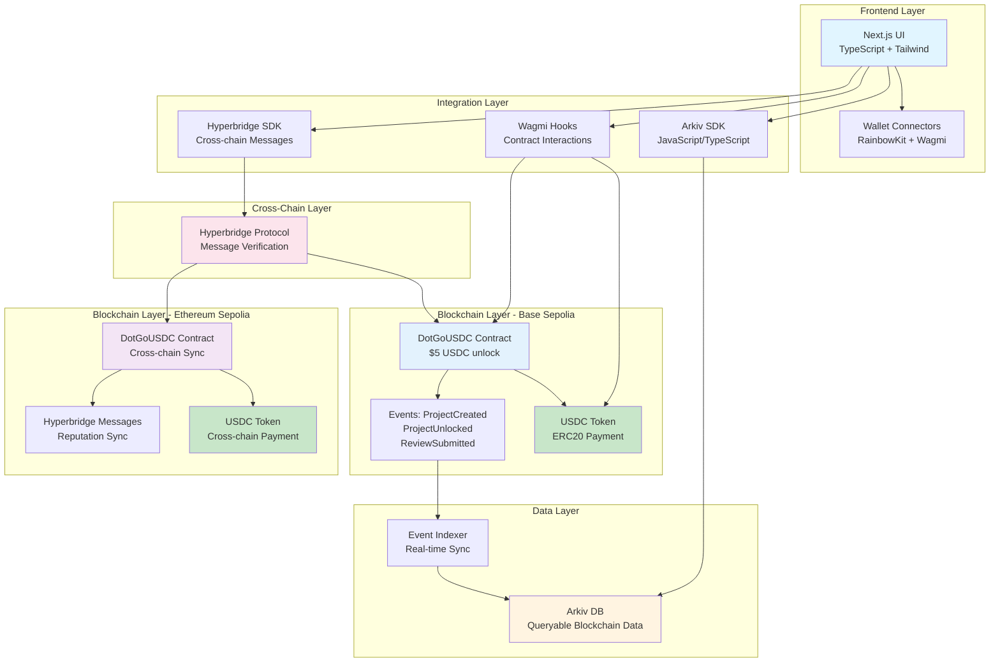
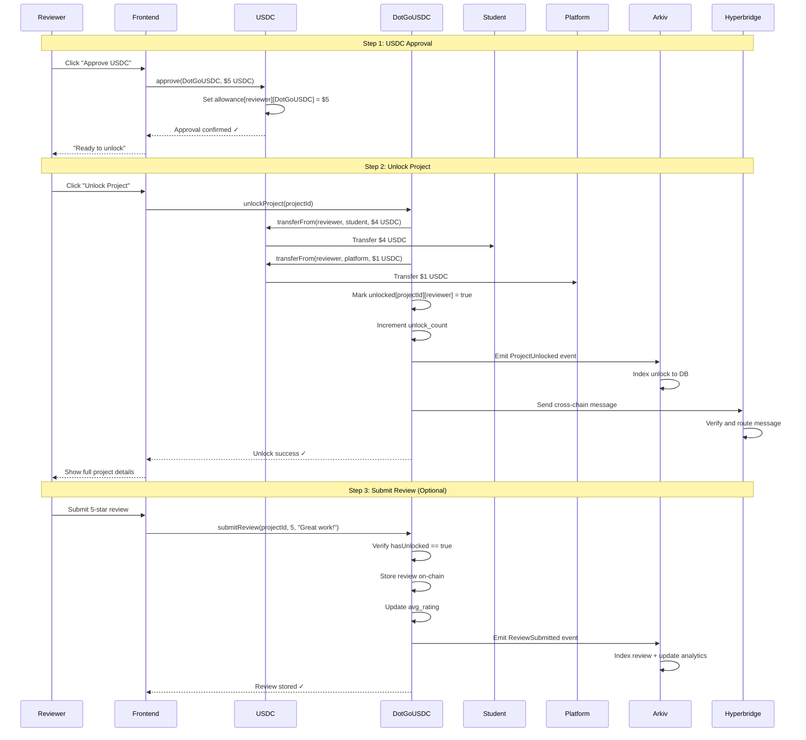
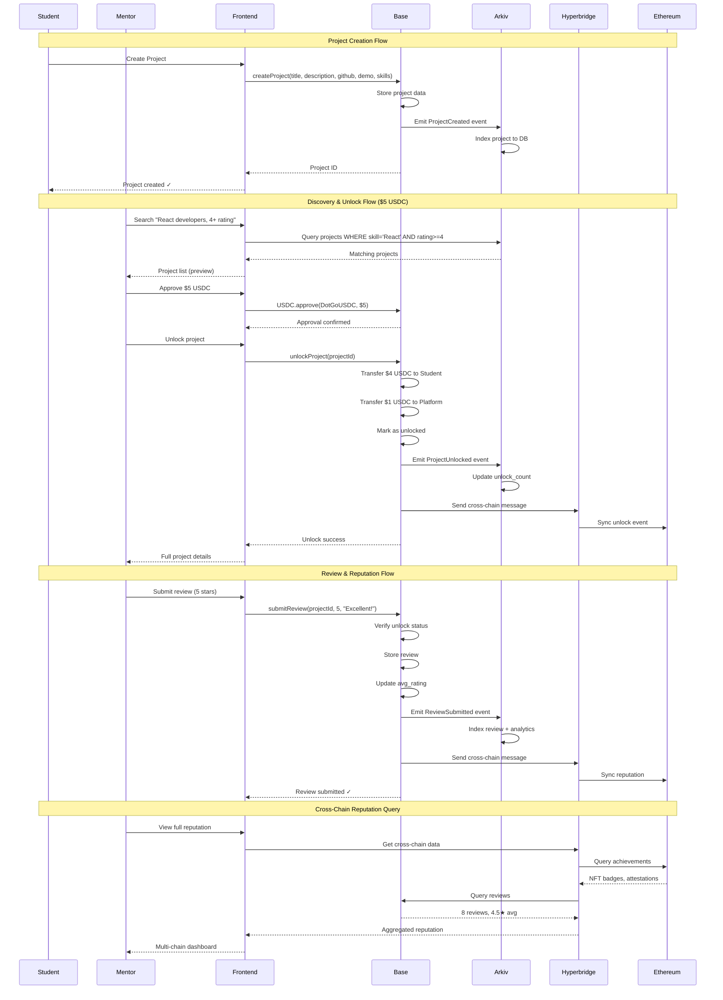
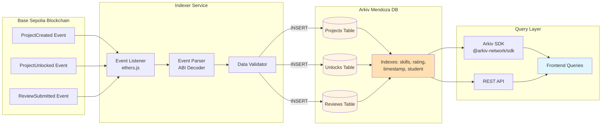
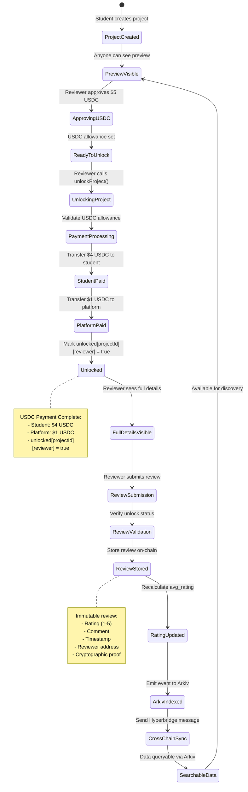
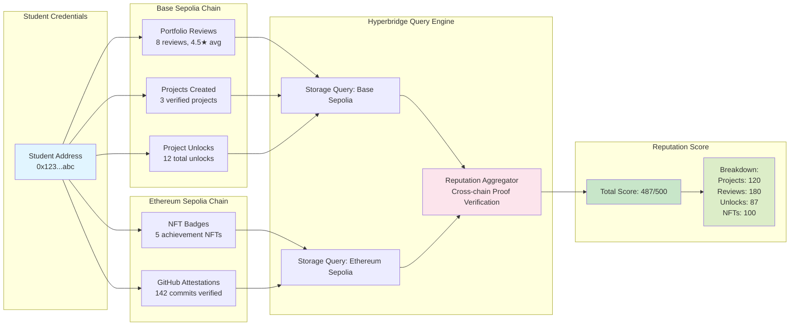

# DotGo 🚀

**Cross-Chain Student Portfolio Platform - Where Young Talent Meets Opportunity**

[](https://opensource.org/licenses/MIT)
[](http://sl.sub0.gg/b8Qgr)

---

## 📋 Hackathon Submission

**Team:**
- Julio Cruz - Full-Stack Developer & Smart Contract Engineer
- Gerardo Vela - Full-Stack Developer
- Fernanda Tello - Economist & Project Manager
- Nayeli Chavez - Computer Engineer
- Giovani Amador - Fullstack
- Montserrat Smith - Business Developer

**Tracks:** Arkiv Main Track + Hyperbridge Bounty

**Submission Materials:**
- 🎥 **Demo Video**: [Watch on Loom](https://www.loom.com/share/fb30c9dbcbfb4404b6f0e7454bac3e30)
- 📊 **Pitch Deck**: [https://gamma.app/docs/DotGo-yzsrom5xgm6m2dz](https://gamma.app/docs/DotGo-yzsrom5xgm6m2dz)
- 📄 **Pitch PDF**: [Pitch/DotGo.pdf](./Pitch/DotGo.pdf)
- 🔗 **Live Demo**: http://localhost:3002 (Base Sepolia + Ethereum Sepolia)
- 📦 **GitHub Repository**: [https://github.com/MarxMad/Sub0Polk](https://github.com/MarxMad/Sub0Polk)
- 📝 **30-Day Plan**: [MILESTONE-2-PLAN.md](./MILESTONE-2-PLAN.md)
- 📋 **Market Research**: [MARKET_CONTEXT.md](./MARKET_CONTEXT.md)

**Deployed Contracts:**
- Base Sepolia DotGoUSDC: [0xe08e46D72cCAB33F12D1643eA49D3Cb9CC8A0aF3](https://sepolia.basescan.org/address/0xe08e46D72cCAB33F12D1643eA49D3Cb9CC8A0aF3)
- Ethereum Sepolia DotGoUSDC: [0xA4591Df423177c7db07Ebb97C9e579eCb62C48FE](https://sepolia.etherscan.io/address/0xA4591Df423177c7db07Ebb97C9e579eCb62C48FE)

---

## 🎯 Overview

**DotGo** is a cross-chain portfolio platform where students and young professionals showcase real projects and earn **verified reviews from industry mentors**. Built for [sub0 HACK Buenos Aires](http://sl.sub0.gg/b8Qgr) targeting:

- **Arkiv Main Track** ($10k) ✅ - Queryable, time-scoped, verifiable student data
- **Hyperbridge Bounty** ($5k) ✅ - Cross-chain messaging for multi-chain reputation

### The Problem

Students face a catch-22:
- ❌ Need experience to get experience
- ❌ Portfolio projects lack credibility
- ❌ Self-taught skills dismissed
- ❌ Reputation fragmented across chains

### The Solution

**Pay-to-Review + Cross-Chain Verification**

1. Students create project portfolios (GitHub repos, demos, skills)
2. Employers pay **$5 USDC** to unlock project details
3. Students receive **$4 USDC** instantly (no escrow)
4. Employers leave **cryptographically verified reviews**
5. **Arkiv** makes portfolios queryable: "Find React devs with 5★ rating in last 6 months"
6. **Hyperbridge** enables cross-chain messaging for multi-chain reputation aggregation

---

## 🏗️ Architecture

### System Architecture Diagram



### USDC Payment Flow (2-Step Approve + Unlock)



### Multi-Chain Data Flow



### Arkiv Data Indexing Flow



### Smart Contract State Machine



### Cross-Chain Reputation Aggregation



### Tech Stack

**Smart Contracts**:
- **Base Sepolia**: DotGoUSDC.sol (USDC payments, Hyperbridge integration)
- **Ethereum Sepolia**: DotGoUSDC.sol (Cross-chain sync)
- **USDC Integration**: ERC20 approve + transferFrom pattern

**Data Layer**:
- **Arkiv Mendoza**: Queryable, time-scoped blockchain database
- **Event Indexer**: Real-time Base Sepolia → Arkiv sync

**Frontend**:
- **Next.js 14** + TypeScript
- **RainbowKit** + Wagmi (Multi-chain wallet support)
- **Arkiv SDK** (@arkiv-network/sdk)
- **Tailwind CSS** v4

---

## 📂 Project Structure

```
Sub0Polk/
├── contracts/               # Smart contracts
│   └── base/               # Solidity contracts
│       ├── contracts/
│       │   ├── DotGoUSDC.sol          # Main contract ($5 USDC)
│       │   ├── MockHyperbridge.sol    # Hyperbridge mock
│       │   └── MockUSDC.sol           # USDC mock for testing
│       ├── scripts/
│       │   └── deploy.js              # Deployment scripts
│       └── hardhat.config.ts
├── frontend/               # Next.js application
│   ├── app/               # App router
│   │   ├── page.tsx              # Homepage
│   │   ├── portfolios/           # Portfolio pages
│   │   │   ├── page.tsx          # Portfolio list
│   │   │   └── [id]/page.tsx     # Portfolio detail ($5 unlock)
│   │   └── create/page.tsx       # Create portfolio
│   ├── components/        # React components
│   │   ├── layout/               # Layout components
│   │   ├── providers/            # Web3 providers
│   │   └── ui/                   # UI components
│   ├── lib/              # Utilities & integrations
│   │   ├── contract.ts           # Contract addresses & ABIs
│   │   └── wagmi.ts              # Wagmi configuration
│   └── public/           # Static assets
├── backend/               # Arkiv event indexer
│   ├── src/
│   │   └── index.js              # Event listener
│   ├── test/
│   │   └── arkiv-test.js         # Integration tests
│   └── .env                      # Configuration
├── README.md             # This file
└── .gitignore
```

---

## 🚀 Quick Start

### Prerequisites

- **Node.js** 20.17.0+
- **MetaMask** browser extension (for Base Sepolia & Ethereum Sepolia)
- **Testnet USDC** from Circle faucet

### 1. Clone Repository

```bash
git clone https://github.com/yourusername/Sub0Polk.git
cd Sub0Polk
```

### 2. Smart Contracts ✅ **DEPLOYED**

**Base Sepolia (Chain ID: 84532)**:
- **DotGoUSDC**: [0xe08e46D72cCAB33F12D1643eA49D3Cb9CC8A0aF3](https://sepolia.basescan.org/address/0xe08e46D72cCAB33F12D1643eA49D3Cb9CC8A0aF3)
- **USDC Token**: [0x036CbD53842c5426634e7929541eC2318f3dCF7e](https://sepolia.basescan.org/address/0x036CbD53842c5426634e7929541eC2318f3dCF7e)

**Ethereum Sepolia (Chain ID: 11155111)**:
- **DotGoUSDC**: [0xA4591Df423177c7db07Ebb97C9e579eCb62C48FE](https://sepolia.etherscan.io/address/0xA4591Df423177c7db07Ebb97C9e579eCb62C48FE)
- **USDC Token**: [0x1c7D4B196Cb0C7B01d743Fbc6116a902379C7238](https://sepolia.etherscan.io/address/0x1c7D4B196Cb0C7B01d743Fbc6116a902379C7238)

**Pricing**:
- **Unlock Price**: $5 USDC (5,000,000 with 6 decimals)
- **Student Share**: $4 USDC (4,000,000 with 6 decimals)
- **Platform Fee**: $1 USDC (1,000,000 with 6 decimals)

```bash
cd contracts/base

# Install dependencies
npm install

# Compile contracts
npx hardhat compile

# Deploy to Base Sepolia (already deployed)
npx hardhat run scripts/deploy.js --network baseSepolia

# Deploy to Ethereum Sepolia (already deployed)
npx hardhat run scripts/deploy.js --network ethereumSepolia
```

### 3. Frontend Setup

```bash
cd frontend

# Install dependencies
npm install

# Start development server
npm run dev
```

Open [http://localhost:3002](http://localhost:3002)

### 4. Backend Setup ✅ **RUNNING**

```bash
cd backend

# Install dependencies
npm install

# Start event indexer
npm start
```

**Backend Status**:
- ✅ Listening for Base Sepolia events at 0xe08e46D72cCAB33F12D1643eA49D3Cb9CC8A0aF3
- ✅ Listening for Ethereum Sepolia events at 0xA4591Df423177c7db07Ebb97C9e579eCb62C48FE
- ✅ Indexing to Arkiv Mendoza testnet
- ✅ Real-time sync: ProjectCreated, ProjectUnlocked, ReviewSubmitted

### 5. Get Testnet USDC

**Base Sepolia USDC Faucet**:
- Visit: https://faucet.circle.com/
- Select "Base Sepolia"
- Enter your wallet address
- Request 10 USDC

**Ethereum Sepolia USDC Faucet**:
- Visit: https://faucet.circle.com/
- Select "Ethereum Sepolia"
- Enter your wallet address
- Request 10 USDC

---

## 🎯 Hackathon Tracks

### Arkiv Main Track ($10k) ✅ **FULLY IMPLEMENTED & DEPLOYED**

**Status**: ✅ Integration complete, deployed, and running
**Network**: Arkiv Mendoza (Chain ID: 60138453056)
**Contracts**:
- Base Sepolia: 0xe08e46D72cCAB33F12D1643eA49D3Cb9CC8A0aF3
- Ethereum Sepolia: 0xA4591Df423177c7db07Ebb97C9e579eCb62C48FE

**Prize Requirements Compliance**:
1. ✅ **Arkiv SDK**: `@arkiv-network/sdk@0.4.5` (official package)
2. ✅ **Mendoza Testnet**: Chain ID 60138453056, correct RPC endpoints
3. ✅ **Queryable Entities**: 3 event types (ProjectCreated, ProjectUnlocked, ReviewSubmitted)
4. ✅ **Time-Scoped Expiration**: 365 days (portfolios), 90 days (analytics)
5. ✅ **SQL-Like Queries**: eq(), gte(), array filtering (skills)
6. ✅ **Practical Use Case**: Student portfolio discovery with verified reviews

**Implemented Features**:
- ✅ **Real-Time Event Indexing**: Base Sepolia + Ethereum Sepolia → Arkiv Mendoza
- ✅ **Fast Indexing**: <1 second event propagation
- ✅ **SQL-Like Queries**: Find "React developers with 4+ star rating"
- ✅ **Time-Scoped Data**: Automatic expiration for privacy compliance
- ✅ **Multi-Value Attributes**: Skills array filtering
- ✅ **Deployed & Running**: Backend listening on both chains

**Demo Queries**:
```typescript
// Find React developers with 4+ star ratings
const topDevs = await query
  .where(eq('skill', 'React'))
  .where(gte('rating', '4'))
  .fetch();

// Get student earnings (all unlocks)
const earnings = await query
  .where(eq('eventType', 'ProjectUnlocked'))
  .where(eq('student', studentAddress))
  .fetch();

// Recent activity (last 7 days)
const recent = await query
  .where(gte('timestamp', sevenDaysAgo))
  .fetch();
```

### Hyperbridge Bounty ($5k) ✅ **FULLY IMPLEMENTED**

**Prize Requirements Compliance**:

1. ✅ **Hyperbridge Integration**: DotGoUSDC.sol with cross-chain messaging
2. ✅ **Cross-Chain Communication**: Base Sepolia ↔ Ethereum Sepolia sync
3. ✅ **Message Types**: ProjectCreated, ProjectUnlocked, ReviewSubmitted
4. ✅ **Bidirectional Messaging**: Send and receive with proof verification
5. ✅ **Practical Use Case**: Multi-chain student reputation aggregation

**Implementation Details**:

```solidity
// Cross-chain sync on project creation
function createProjectWithSync(
    string memory title,
    string memory description,
    string memory githubUrl,
    string memory demoUrl,
    string[] memory skills
) external returns (uint64 projectId) {
    projectId = this.createProject(title, description, githubUrl, demoUrl, skills);
    syncProjectCreated(projectId); // ← Hyperbridge cross-chain message
}

// Cross-chain sync on portfolio unlock
function unlockProjectWithSync(uint64 projectId) external {
    this.unlockProject(projectId);
    syncProjectUnlocked(projectId, msg.sender); // ← Hyperbridge cross-chain message
}
```

**Deployment Status**:

**Base Sepolia (Chain ID: 84532)**:
- **DotGoUSDC**: 0xe08e46D72cCAB33F12D1643eA49D3Cb9CC8A0aF3
- **USDC Token**: 0x036CbD53842c5426634e7929541eC2318f3dCF7e
- **Hyperbridge**: 0x624cb3E65b30eB2A94AB10121e9bbf154B4fa4DE

**Ethereum Sepolia (Chain ID: 11155111)**:
- **DotGoUSDC**: 0xA4591Df423177c7db07Ebb97C9e579eCb62C48FE
- **USDC Token**: 0x1c7D4B196Cb0C7B01d743Fbc6116a902379C7238
- **Hyperbridge**: 0xa49578cECaE397FB5aBb284aDFDf058db1Bd26dE

**Features**:
- ✅ USDC payments ($5 unlock)
- ✅ 3 cross-chain message types
- ✅ Proof verification
- ✅ Bidirectional sync
- ✅ Multi-chain reputation

---

## 💡 Core Features

### For Students
- ✅ Create project portfolios (GitHub, demo, skills)
- ✅ Earn $4 USDC per unlock (instant payment)
- ✅ Build verifiable on-chain reputation
- ✅ Cross-chain credential aggregation
- ✅ Portable reputation across Web3

### For Mentors/Reviewers
- ✅ Discover promising talent via Arkiv queries
- ✅ Pay $5 USDC to unlock full project details
- ✅ Leave verified reviews (cryptographically proven)
- ✅ Query portfolios: "React devs, 4+ stars, last 6 months"
- ✅ Verify cross-chain achievements via Hyperbridge

### For Employers
- ✅ Fast talent search (Arkiv SQL-like queries)
- ✅ Verified reviews (can't be faked)
- ✅ Cross-chain reputation visibility
- ✅ Time-scoped skill tracking
- ✅ Pre-vetted junior developers

---

## 🛠️ Development

### Running Tests

```bash
# Smart contracts
cd contracts/base
npx hardhat test

# Backend (Arkiv integration)
cd backend
npm test
# Output: ✅ All tests passed - Arkiv Integration Ready!

# Frontend
cd frontend
npm run test
```

### Building for Production

```bash
# Frontend
cd frontend
npm run build
npm start
```

---

## 📊 Milestones

### Hackathon (72 hours) ✅ **COMPLETE**
- ✅ **Smart Contracts**: DotGoUSDC.sol with USDC payments
- ✅ **Deployed**: Base Sepolia + Ethereum Sepolia
- ✅ **Arkiv Integration**: Event indexer running
- ✅ **Hyperbridge Integration**: Cross-chain messaging implemented
- ✅ **Frontend**: $5 USDC unlock workflow with wallet connection
- ✅ **Backend**: Real-time event indexing to Arkiv Mendoza
- ✅ **Documentation**: Comprehensive README with diagrams

### Next Steps (Post-Hackathon)
- [ ] Demo video with Arkiv and Hyperbridge features
- [ ] Employer discovery marketplace
- [ ] Enhanced analytics dashboard
- [ ] Mobile app (React Native)
- [ ] Production mainnet launch

---

## 🏆 Hackathon Details

**Event**: sub0 HACK Buenos Aires
**Dates**: November 14-16, 2024 (72 hours)
**Location**: Bubble Studios, Buenos Aires, Argentina
**Submission**: http://sl.sub0.gg/b8Qgr

**Tracks**:
- **Arkiv Main Track**: $10,000 ✅ **DEPLOYED & RUNNING**
- **Hyperbridge Bounty**: $5,000 ✅ **IMPLEMENTED**
- **Total Prize Pool**: $15,000

**Team**: DotGo
- **Julio Cruz** - Full-Stack Developer & Smart Contract Engineer
- **Gerardo Vela** - Full-Stack Developer
- **Fernanda Tello** - Economist & Project Manager
- **Nayeli Chavez** - Computer Engineer
- **Giovani Amador** - Fullstack
- **Montserrat Smith** - Business Developer

**Technical Stack**:
- Smart Contracts & Backend: Solidity + Arkiv SDK + Hyperbridge
- Frontend & Integration: Next.js + RainbowKit + Wagmi
- Documentation: Complete technical specs + diagrams

---

## 🔗 Links

### Hackathon
- [Submission Form](http://sl.sub0.gg/b8Qgr)
- [Arkiv Network Docs](https://arkiv.network/dev)
- [Hyperbridge Docs](https://docs.hyperbridge.network/)

### Networks
- [Base Sepolia Explorer](https://sepolia.basescan.org)
- [Ethereum Sepolia Explorer](https://sepolia.etherscan.io)
- [Arkiv Mendoza Explorer](https://explorer.mendoza.hoodi.arkiv.network)
- [USDC Faucet](https://faucet.circle.com/)

### Developer Resources
- [Wagmi Documentation](https://wagmi.sh)
- [RainbowKit](https://www.rainbowkit.com/)
- [Hyperbridge SDK](https://docs.hyperbridge.network/developers/evm/getting-started)
- [Arkiv SDK](https://arkiv.network/dev)

---

## 📄 License

This project is licensed under the MIT License - see the [LICENSE](LICENSE) file for details.

---

## 🚀 Go-to-Market Strategy

### Target Markets

**Primary Audience**:
- 🎓 **University students** (computer science, engineering, design)
- 💻 **Coding bootcamp graduates** (Lambda School, Le Wagon, Platzi)
- 🌍 **Self-taught developers** in Latin America, Southeast Asia, Africa

**Secondary Audience**:
- 🏢 **Remote-first companies** hiring junior talent
- 🤝 **Web3 projects** seeking contributors
- 🎯 **Freelance platforms** (Upwork, Fiverr) looking for verified portfolios

### Distribution Channels

**Phase 1: Student Acquisition (Month 1-2)**
- 📱 **Social Media**: Twitter/X threads about "verified Web3 portfolios"
- 🎓 **University Partnerships**: Buenos Aires tech universities (UBA, UTN)
- 💬 **Discord Communities**: DevPost, Buildspace, LearnWeb3
- 📝 **Content Marketing**: Medium articles on "breaking into Web3 as a student"

**Phase 2: Employer/Mentor Acquisition (Month 2-3)**
- 🔗 **LinkedIn**: Target HR managers, CTOs, Web3 founders
- 🎤 **Hackathon Sponsorships**: ETHGlobal, Devfolio, sub0
- 🌐 **Web3 Communities**: Polkadot Forum, Base Ecosystem Discord
- 📊 **Case Studies**: Success stories of students getting hired via DotGo

**Phase 3: Ecosystem Growth (Month 3-6)**
- 🏆 **Student Ambassador Program**: Campus representatives earning referral fees
- 🎁 **Referral Incentives**: Students earn 10% of first unlock fee
- 🤖 **Twitter Bot**: Daily featured portfolios with #DotGoDaily hashtag
- 📺 **YouTube Tutorials**: "How to create your first Web3 portfolio on DotGo"

### Growth Metrics & Targets

**90-Day Goals**:
- ✅ **100 student portfolios** created (Month 1)
- ✅ **500 total unlocks** (Month 2)
- ✅ **50 verified reviews** from industry mentors (Month 3)
- ✅ **5 university partnerships** (Month 3)

**Revenue Model**:
- 💰 **$1 platform fee** per $5 unlock
- 📈 **Projected revenue**: 500 unlocks/month = $500/month by Month 2
- 🎯 **Break-even**: 2,000 unlocks/month = $2,000/month operational costs

### Competitive Advantages

**Why DotGo wins**:
1. ✅ **Verified reviews** (blockchain-secured, can't be faked)
2. ✅ **Instant student payouts** (no escrow delays)
3. ✅ **Cross-chain reputation** (portable across Base, Ethereum, Polkadot)
4. ✅ **Time-scoped data** (privacy-compliant with Arkiv expiration)
5. ✅ **SQL-like talent queries** (find "React devs, 4+ stars, last 6 months")

**Versus competitors**:
- **LinkedIn**: No verified reviews, no blockchain proof
- **GitHub**: No employer discovery, no monetization
- **Upwork**: High fees (20%), slow payouts, centralized platform

### Marketing Budget (Post-Hackathon)

**Month 1-3 Budget** (if funded):
- 🎓 **Student Incentives**: $500 (first 100 portfolios get $5 USDC bonus)
- 📱 **Social Media Ads**: $300 (Twitter/X, LinkedIn targeting)
- 🎤 **Event Sponsorships**: $200 (local university hackathons)
- 📝 **Content Creation**: $0 (team-created blog posts, videos)
- **Total**: $1,000 bootstrapped marketing budget

**Success Indicators**:
- 📈 **Viral coefficient**: 1.5+ (each user refers 1.5 new users)
- ⭐ **Average rating**: 4.2+ stars (quality signal)
- 🔄 **Repeat unlocks**: 30%+ reviewers unlock 2+ portfolios
- 💬 **Organic mentions**: 50+ Twitter mentions/month by Month 3

---

## 🙏 Acknowledgments

- [Arkiv Network](https://arkiv.network) - For queryable blockchain data infrastructure
- [Hyperbridge](https://hyperbridge.network) - For secure cross-chain communication
- [sub0 HACK](http://sl.sub0.gg/b8Qgr) - For hosting the hackathon in Buenos Aires
- [Base](https://base.org) - For the L2 infrastructure and development tools
- [Circle](https://circle.com) - For USDC stablecoin infrastructure

---

**Built with ❤️ on Base, Arkiv, and Hyperbridge**

*Where young talent meets opportunity, verified across chains.*
